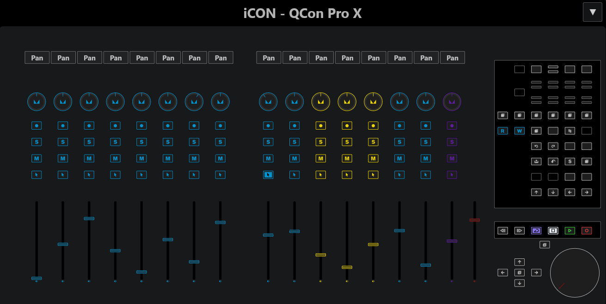

# Cubase Midiremote for iCON QCon Pro X

<!--  -->
<!--  -->

<!--  -->

Cubase MIDI Remote Scripts for DAW Controllers using the MCU Protocol

  

Code forked from [bjoluc/cubase-mcu-midiremote](https://github.com/bjoluc/cubase-mcu-midiremote) and adapted specifically for the iCON QCon Pro X.

So most credits go to bjoluc for providing a good base to work from. Most of the text below is lifted quite literally from bjoluc's repository because it is also relevant for this project.

**Main features**

- Support for the second screen (Channel names / Peak indicator / Fader volume indicator when moving fader)
- Main Volume Leds working (mono only apparently, unfortunately)
- All Function-buttons (F1-F16) assignable and working as they do on the original hardware with the two layers.

**Encoder Assignments**

- The lower scribble strip row always shows track names since they are vital to using each channel's buttons and fader, regardless of the encoder assignment. Parameter page numbers are displayed on the otherwise unused two-digit Assignment display instead. If an encoder assignment only has one parameter page, the Assignment display remains blank.
- Shift-pushing an encoder resets its parameter to the default value, if a static default value is known.
- The "Track" encoder assignment has additional parameter pages for Low Cut, High Cut, and the Track Quick Controls of the selected track.
- By default, pushing encoders in the "Pan/Surround" encoder assignment resets a channel's panner instead of toggling its "Monitor Active" state. If you'd like to toggle "Monitor Active" instead, you can set the `resetPanOnEncoderPush` [config option](#configuration-options) to `false`.
- You can enable and disable EQ bands by pushing their encoders – with one exception: Pushing an EQ gain encoder inverts the EQ gain.
- Instead of spreading the "Send" encoder assignment options out on four parameter pages, there are only two pages for sends now. The "Level" and "On" pages have been combined into a single page where turning encoders modifies the send level and pushing encoders toggles a send slot's On/Off status. The "Pre/Post" page remains untouched, and the "Bus" page is omitted because the MIDI Remote API doesn't expose send busses. If your Cubase version supports it, there are also four additional pages for Cue sends 1-4.
- The "Plug-In" encoder assignment always follows the currently focused plugin window to avoid tedious plugin selection via push encoders.
- The first page of the "Inst" encoder assignment maps encoders to the VST Quick Controls of the currently selected instrument track. The remaining pages map 8 encoders to each part of the channel strip, i.e., gate, compressor, tools, saturation, and limiter. Pushing the last encoder of a channel strip effect toggles the effect's bypass status.

The table below summarizes all available encoder assignments:

<!-- prettier-ignore -->
| MCU button label | Cubase button label | Available parameter pages |
| --- | --- | --- |
| **Track** | Page Up | <ol><li>Monitor</li><li>Pre Gain</li><li>Phase</li><li>Low-Cut Frequency / Enabled</li><li>High-Cut Frequency / Enabled</li><li>Selected Track Quick Controls</li></ol> |
| **Send** | Page Down | <ul><li>Send Levels / Enabled (8 encoders)</li><li>Send Pre/Post (8 encoders)</li><li>Cue 1 Send Level / Enabled</li><li>Cue 2 Send Level / Enabled</li><li>Cue 3 Send Level / Enabled</li><li>Cue 4 Send Level / Enabled</li></ul> |
| **Pan/Surround** | Pan | Pan |
| **Plug-In** | Inserts | All Remote Control Editor parameter pages of the currently focused plugin (all encoders) |
| **EQ** | EQ | <ul><li>EQ Bands 1 & 2 (8 encoders)</li><li>EQ Bands 3 & 4 (8 encoders)</li></ul> |
| **Instrument** | FX Send| <ul><li>Remote Control Editor parameters of the selected track's VST instrument (all encoders)</li><li>Channel Strip Gate (8 encoders)</li><li>Channel Strip Compressor (8 encoders)</li><li>Channel Strip Tools (8 encoders)</li><li>Channel Strip Saturation (8 encoders)</li><li>Channel Strip Limiter (8 encoders)</li></ul> |

**Buttons**

- The 16 Function buttons are unassigned, so you can add whatever function you want. You'll see 16 buttons in the midi remote editor to assign functions to.
- The Channel Left/Right buttons navigate between encoder assignment pages instead of moving the fader bank left/right by one channel. The latter can be achieved by using the shift-button in combination with the Channel Left/Right buttons.
- Pressing "Shift + Bank Left" navigates to the first (=leftmost) mixer bank.
- Pressing "Shift" + "Rewind"/"Forward" moves the cursor to the project's start/end position.
- Pressing "Shift + Edit" closes all **plugin** windows instead of only the currently active window (I couldn't find a command to "close the currently active window").
- The "VST" and "Master" buttons are assigned to the handy MixConsole History Undo and Redo commands, respectively. In the default MCU mapping, they would activate instrument and main insert effects encoder assignments. However, these can already be reached via the "Inst" and "Plug-In" encoder assign buttons, so I decided to use the buttons differently.
- For the same reason, the "Sends" button doesn't activate a send effects encoder assignment. Instead, it turns the rightmost push encoder and the jog wheel into controllers for the value that's currently under the mouse cursor – like the Steinberg CC121's AI knob.
- Pressing "Shift + Display Name/Value" flips the scribble strip display rows

## Drawbacks

Current limitations of the MIDI Remote API:

- The "Track" encoder assignment is missing the "Input Bus" and "Output Bus" pages which are not exposed by the MIDI Remote API.
- The "Pan/Surround" encoder assignment is missing a second page for vertical panning which is not exposed by the MIDI Remote API.
- The "Send" encoder assignment doesn't include a "Bus" page because send busses are not exposed by the MIDI Remote API.
- The "Plug-In" encoder assignment doesn't display the number of the active parameter page because it is not exposed by the MIDI Remote API.
- The "Inst" encoder assignment doesn't allow loading/switching channel strip plugins because the MIDI Remote API doesn't provide options for it.
- The punch button doesn't light up when "Auto Punch In" is activated – no host value available
- The "Solo Defeat" button doesn't light up when a channel is in solo mode
- Channel visibility presets do not yet affect channel assignments since the `MixerBankZone` of the MIDI Remote API doesn't respect channel visibility presets (["`.setFollowVisibility()` is a teaser for future updates"](https://forums.steinberg.net/t/820531/2)).
- When in mouse value control mode, the encoder's LED ring is not updated to single-dot mode but remains in whatever mode the currently active encoder assignment demands (blocked by https://forums.steinberg.net/t/831123).

## Troubleshooting

Having issues with the scripts? Here are some common problems and potential solutions you should try before reporting an issue:

### Some buttons do not work as expected

You can re-map most surface elements (buttons, faders, encoders) using the MIDI Remote Mapping Assistant in Cubase.
Those mappings are stored as JSON files in a `User Settings` folder at `Documents/Steinberg/Cubase/MIDI Remote/User Settings`, next to the MIDI Remote `Driver Scripts` folder.
If some button/fader/encoder isn't working as expected – especially after an update to the script – it is always worth a try to remove the user setting files (those starting with your script's name) to make sure they don't interfere with the script's default functionality.
Afterwards, restart Cubase to reload the MIDI Remote scripts and settings.

If that still didn't help, [disabling and re-enabling](#how-to-disable-and-re-enable-a-controller-script) the controller script can solve some mapping issues as well.

### Some displays are lagging or faders are stuttering heavily when reading automation

This might be caused by another source sending MIDI data to your device, for instance Cubase's default Mackie Control remote device integration.
Make sure you have removed all Mackie Control remote devices in the studio setup window, or that you have selected "Not Connected" for their ports.

### The SMPTE/Beats button doesn't change the time format

The SMPTE/Beats button is mapped to the "Exchange Time Formats" command which switches between the primary and secondary time format.
The button has no effect when both time formats are identical, so make sure you have selected different primary and secondary time formats.

### One or multiple devices are unresponsive

Try [disabling and re-enabling](#how-to-disable-and-re-enable-a-controller-script) the controller script in the MIDI Remote Manager to make Cubase re-detect the script's MIDI ports.
If that doesn't solve it and the unresponsive device is connected via network MIDI, it might help to [configure a lower bitrate](https://github.com/bjoluc/cubase-mcu-midiremote/issues/27#issuecomment-1930624505).

### How to disable and re-enable a controller script?

